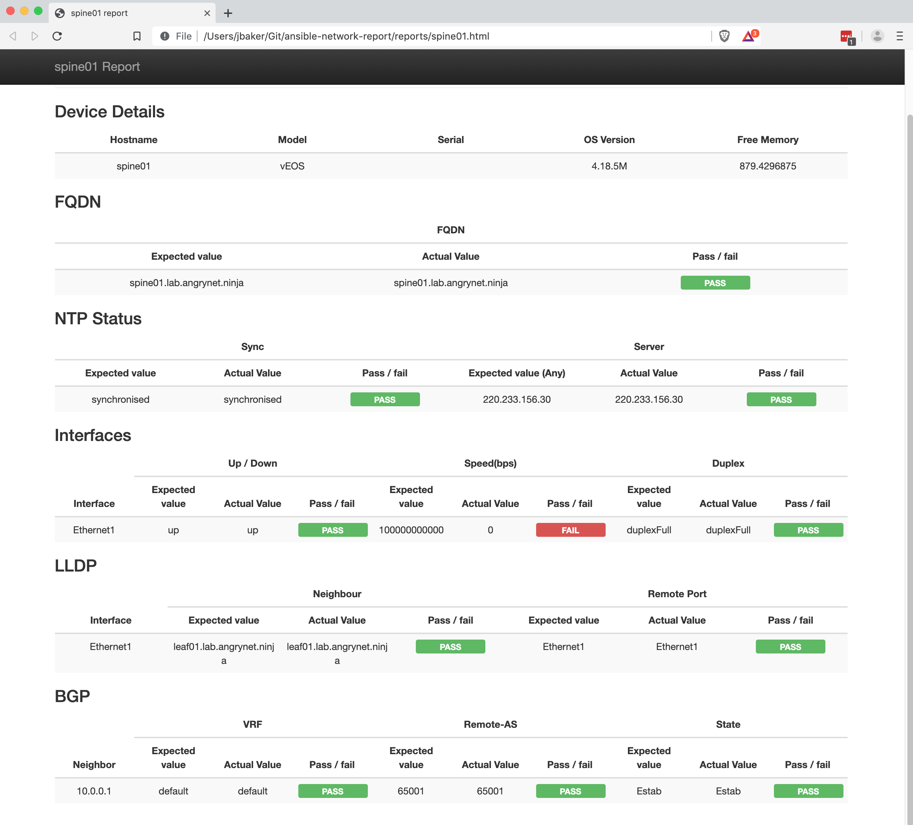

# ansible-network-report

One of the most annoying tasks for any network operator is ensuring your intended state of the network is what is actually being run in the network.

This playbook checks the intended state as defined in the host and group vars sections against the running state of a specific device and outputs a html page with a simple pass / fail button.

## Aim

* Use of core modules and functionaility
* Reduce the reliance on external libraries
* Support portability between vendors

## Requirements

* [ansible](https://pypi.org/project/ansible/)
* [jmespath](https://pypi.org/project/jmespath/)
* [paramiko](https://pypi.org/project/paramiko/)
* [textfsm](https://pypi.org/project/textfsm/)

## Running the playbook

Use the `ansible-playbook` command:
```
$ ansible-playbook playbooks/report.yml
```

This will generate a html report for each device in the reports directory

## Example Output



## Vagrant

Included in this repository is a quick lab to setup and run the playbook against. This requires an arista/veos vagrant box installed as well as virtualbox.

More information on vEOS and Vagrant here: https://eos.arista.com/using-veos-with-vagrant-and-virtualbox
